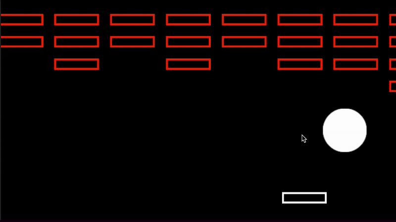
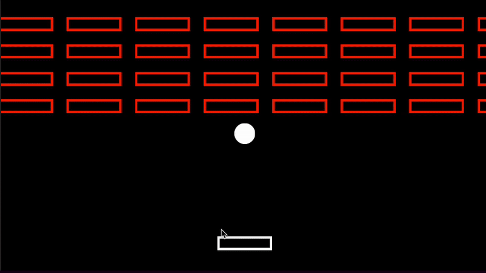
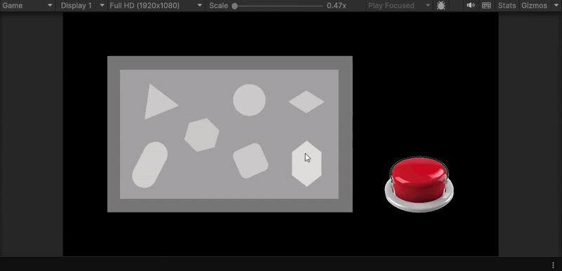
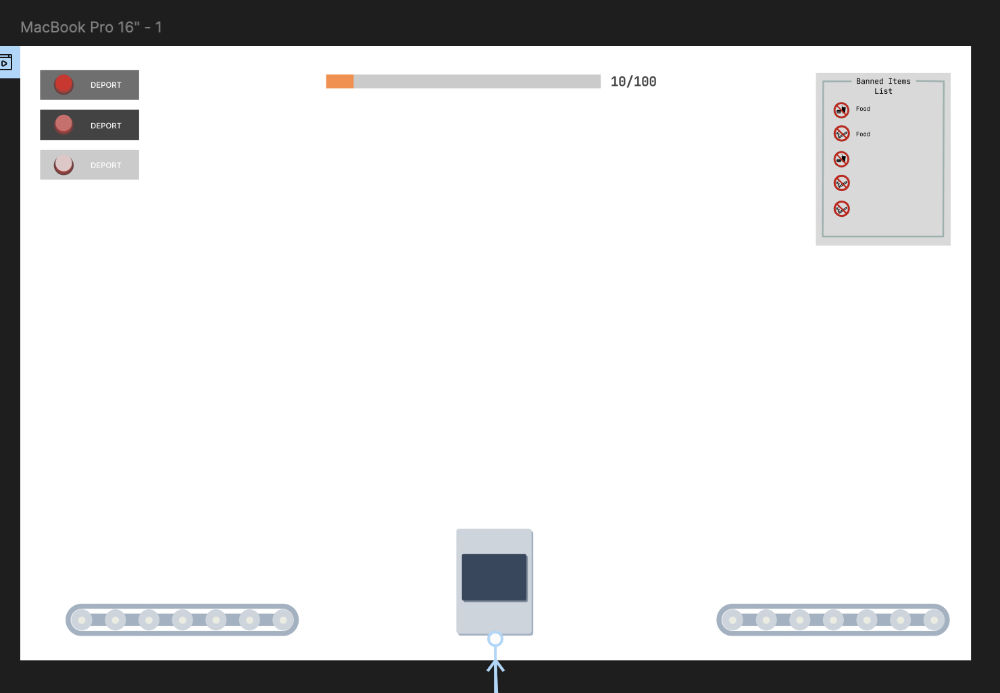
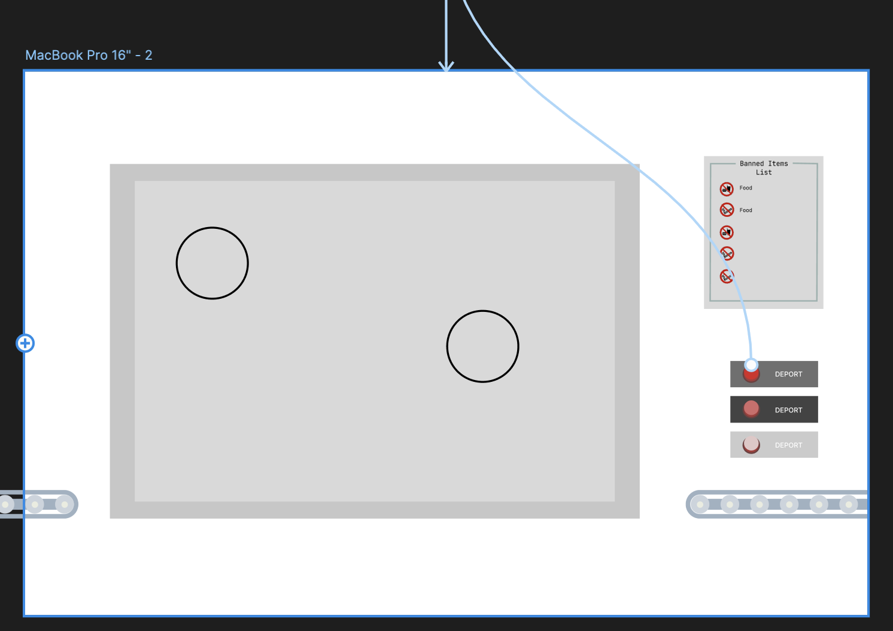
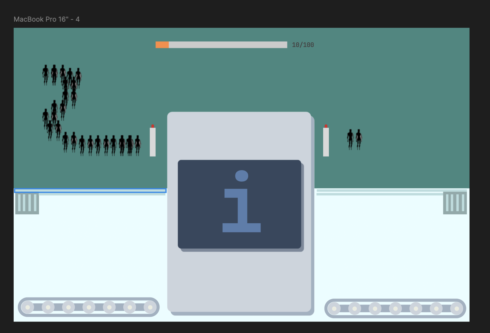
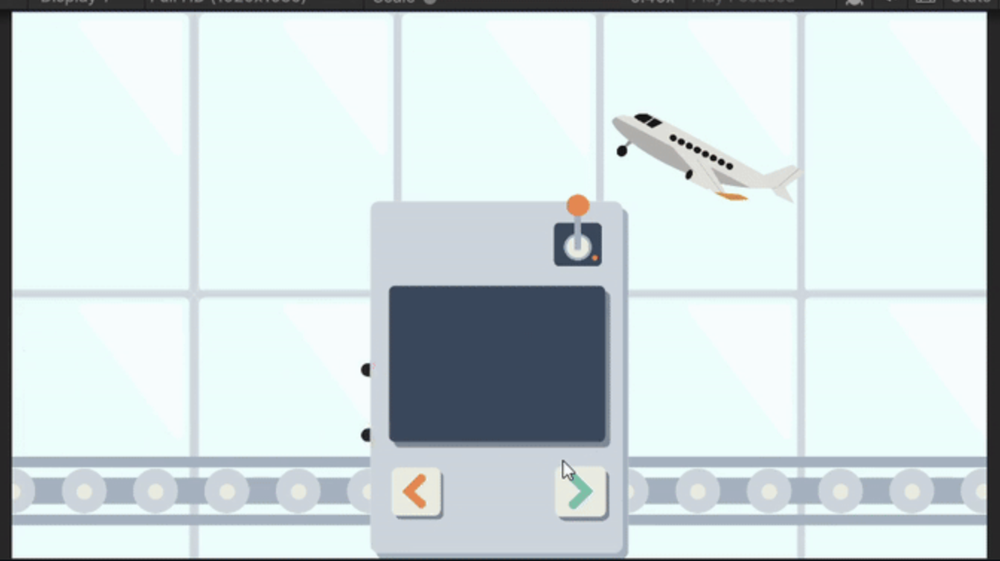

# Process Journal

## Tiny Game / 01.23.25

## 20/01/24

So far, after browsing the different tools, I’m leaning toward Ink as the scripting language. I have played games on the Pico-8 engine before, but the learning curve to making a game on it seems daunting. I feel most comfortable with front-end web languages, but.. I don’t know. I feel like a theatre major can better write a script than I can lmao. I’ve never been into the point-and-click branching narrative games and always found their origins pretty lame, but a compelling narrative is what often draws me in video games rather than game mechanics. I feel like I’m at a standstill haha. Let’s see how it goes.

## 22/01/24

Ok so I messed around with the basic tutorial on the inklestudios website. And realized I’m not good at learning stuff this way. So I generated a script where a person enters a door, and keep entering the same door endlessly. It currently does not have a an ending. I’m not sure I’ll leave it like this. But it is pretty funny you can’t actually get out of this singular branch that keeps repeating itself.

## 23/01/24 – Playtest

Hmm so people found it the game more experimental more than fun. I guess that was kinda the intention with stuff I make. I do still struggle to make things playful. I’d like to be able to take more risks with what I make and build more momentum. Although this was only a pass or fail assignment so hopefully I can make something as engaging with more interactivity.

[this is a link]()

**bold text**

_italics_

## Design Journal: Exploration Prototype 1

Okay bit of a late start on this as I was a little confused on the deadlines on moodle. I was able to follow along in class pretty well, but I do have some errors in my script. I think a good place to start would be to debug my code and have a working prototype to start off with. 

Okay small syntax error that I had not noticed before. Need to get more familiar with the c# syntax if I want to avoid unnecessary time debugging. 

Okay I decided to go find a tutorial that I can follow. I feel like that's often a good starting point for me when using a new software that I might not be as familiar with. I landed on this tutorial.

[https://www.youtube.com/watch?v=K1xZ-rycYY8&ab_channel=bendux]()

I made a pretty simple platformer. 

It's nothing impressive, but I got to be more familiar with the Unity interface and the workflow of adding a **Sprite Renderer**, **RigidBody** or a **Box Collider**. I think as I spend more time getting familiar with the workflow I can get my ideas flowing a lot easier. I think with the time I spent on this it was a decent exploration of the workflow using Unity. Just need to start getting more creative and starting these explorations a little earlier. 

Uhh I'm not too sure how I'm supposed to push my Unity Project on Github, I'll ask the professor in class today and submit the process journal. 

## Design Journal: Exploration Prototype 2

Okay finally went back the Pong game we made in class. Here are some thoughts after I played it a couple of times. 

The paddles move a little too quick. The ball is a little slow. The trajectory of the ball is predictable. Not sure is this is a good or bad thing. Does it make it less fun this way? Maybe prototyping here could help with some answers

Technical points aside, I'm not sure I know how to approach this prototype. The first thought that comes to mind is Pippin's game. [https://pippinbarr.com/pongs/info/]()

I guess since this is meant to be a prototyping class, approaching this game in the same spirit as Pippin's PONGS is not a terrible idea. I just feel as though this would only be fulfilling if I can get many iterations done. Let's try to get a head start today. 

Let's brainstorm:

* Invisible paddels
* Invisible ball
* Triangle shaped paddles
* Multiple balls
* Every time the ball spawns, Fetty Wap Again plays
* Gravity ball
* Paddle moves horizontally (each court)
* HUGE paddle
* Ball that leaves a trail
* HUGE ball (ball gets bet bigger each time)
* Fast ball (ball gets faster each time)

Okay here are the following two itterations I worked on. 

Learned a few things. I think iterating quickly and with little investment into anything other than the mechanic you're trying to explore is key. These prototype were not costly in time to make but made for great visual feedback for how small changes in parameters can change the feel of the game.  

## Design Journal: Exploration Prototype 3

Ok I thought maybe it'd be a good idea I start writing just to document the troubleshooting I've had to do for a little bit. Spent the past 20 mins trying to get the script to not give me a missing reference error, even though it was attached properly. Turns out since it was a Prefab, it had to be referenced in the Prefab for the script to link to the game object... What a waste of time. 

Now time to figure why my ball script is not working. 

Ok I'm stupid the ball script works I just had to press space. 

Now time to figure out how to break the walls. 

Ok I ended up searching for a block breaker game and ended up playing google's game. Gave me some solid ideas for fun game mechanics. Don't know how many I'll end up implementing. 

This is so I remember where I left off for when I next work on this. 

    if (other.gameObject.tag == "Brick")
    {
    // make pitch lower
    blip.pitch = 1.25f;
    blip.Play();
    Destroy(gameObject);
    SpeedCheck();
    
    }

Ok got the bricks to destroy when ball makes contact with following:

    if (other.gameObject.tag == "Brick")
    {
    blip.pitch = 1.25f;
    blip.Play();
    Destroy(other.gameObject); // ✅ This destroys the BRICK, not the ball
    SpeedCheck();
    }

Hmm so let's see what the easiest first implementation I could do. 

Ok how about I start with having a limited amount of balls you can have. Let's try that. 

## Design Journal: Exploration Prototype 4

Ok last class got cancelled and it looks like we're supposed to keep working on our previous prototype. Kinda not feeling inspired by the lives system I was trying to make last time. I'd rather do some quick and dirty iterations and get the ball rolling instead. Let's see. 

Holy fuck my game was broken again. Ideally I'd write some comments to figure this out a lot quicker. Ok base game works now.

Ok below are some gifs comparing what the first game looked like and the iteration i was able to make. 

original game

## Design Journal: Iterative Prototype 1

### Ideas for the game

Game types:

* Branching narratives
* Open world

Art Styles: 

* Pixel art and/or 8-bit music

Game Examples:

* Papers Please 
* The Stanley Parable
* Detroit: Become human (not the graphics, but the branching narrative)
* The Legend of Zelda: Tears of the Kingdom

It would be a good idea to do some "user research" on who would be best fit to play our game.  

Ok after having a first sit down conversation with the team, we were able to get the big questions out of the way. The first thing I wanted to discuss is what expectations we had towards the project. I wanted to inquire about everyone's workload this semester and get an idea on how much time people were willing to spend on the project.

After that out of the way, we discussed the different types of games we enjoy playing, what we liked about them and how we could integrate some of those features into our game. We were able to the division of labour and we're on our way to start the first few prototypes. 

## Design Journal: Iterative Prototype 2

Ok below is a few things team and I worked on. 

Ok working on getting the main loop of the game working. I'm working on Figma prototyping the flow of interactions in the game. My role has been to help with the UI of the game. There are times where the scenes feel like assets put together for the sake of having assets. Been trying to work with the team with finding the right balance of aesthetics and functionality. 

Been really enjoying working on figma. More than just illustrator or photoshop some reasone. The workflow feels much more streamline to having an end product and the tools are similar across the plateforms that the transitions was easy. 

## Design Journal: Iterative Prototype 3

Above is the DEPORT button I prototype for our game. Placed it at the top as I could see this being an animation where it drops down for a certain condition.

We are starting to get in the process of the game where we actually have to be clear on what the game mechanics are. And it feels like the team has different understanding of how this might look. With each person presenting their pov, we were able to find some common ground after some back and forth. Here's a little summary:

DEPORT VS TERRORIST BUTTON
Ok I initially went with the deport button because of my bias for papers please. But as I thought about the implications, I thought it well reflected the political climate of the USA that are trying to comment on with this game.

When discussing, a team member was more leaning towards a TERRORIST button, as they found the extreme nature of the word was more satirical in nature. I was not sold on the idea, but I then understood that their vision of the commentary was on the TSA itself after the events of 9/11. After understanding, I was more convinced on the idea.

Ok we discussed the implications of the stamps and the different buttons. I think where there was most friction was with the foreground and background of the conveyor belt scene. To give a TLDR, my teammates were more interest in a layout that made the background of same hierarchy as the foreground vs when prototyping I had more in mind a contrasting foreground and background. Below are the prototypes I'm talking about.

I appreciated the lower fidelity silhouette of people in line progressing through the TSA line. My teammates felt as though the inital prototype with the glasses was better as it better represented an airport. I was firm about my position of having the miniature line, but maybe having the solid green be an airport floor instead. With still a lot of pushback, we ended on wanting to do a more complete prototype of the glasses prototype with silhouettes of people passing by.

I think it would be a good idea to also present a more complete prototype of what I wanted the background to look like. I am open-minded in making compromises and meet my teammates in the middle. However, my wish for the full game having different characters, branching narratives and interesting dialogue I think is best suited with a visual design that feels less like a web game. I need to tread lightly in working with the current art style as the clip art nature of the assets might make the game feel a little shallow. I have expressed this to my teammates, I just need to best work to find the middle ground in what suits everyone best. I do understand the want of making the game feel more satirical, but I keep pushing back on some of the design and aesthetic choices due to the concerns mentioned prior. To be continued!
