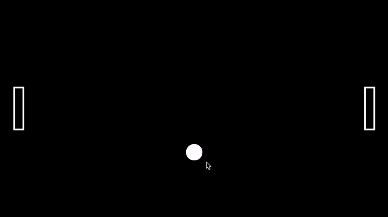

# Process Journal

## Tiny Game / 01.23.25

## 20/01/24

So far, after browsing the different tools, I’m leaning toward Ink as the scripting language. I have played games on the Pico-8 engine before, but the learning curve to making a game on it seems daunting. I feel most comfortable with front-end web languages, but.. I don’t know. I feel like a theatre major can better write a script than I can lmao. I’ve never been into the point-and-click branching narrative games and always found their origins pretty lame, but a compelling narrative is what often draws me in video games rather than game mechanics. I feel like I’m at a standstill haha. Let’s see how it goes.

## 22/01/24

Ok so I messed around with the basic tutorial on the inklestudios website. And realized I’m not good at learning stuff this way. So I generated a script where a person enters a door, and keep entering the same door endlessly. It currently does not have a an ending. I’m not sure I’ll leave it like this. But it is pretty funny you can’t actually get out of this singular branch that keeps repeating itself.

## 23/01/24 – Playtest

Hmm so people found it the game more experimental more than fun. I guess that was kinda the intention with stuff I make. I do still struggle to make things playful. I’d like to be able to take more risks with what I make and build more momentum. Although this was only a pass or fail assignment so hopefully I can make something as engaging with more interactivity.

[this is a link]()

**bold text**

_italics_

## Design Journal: Exploration Prototype 1

Okay bit of a late start on this as I was a little confused on the deadlines on moodle. I was able to follow along in class pretty well, but I do have some errors in my script. I think a good place to start would be to debug my code and have a working prototype to start off with. 

Okay small syntax error that I had not noticed before. Need to get more familiar with the c# syntax if I want to avoid unnecessary time debugging. 

Okay I decided to go find a tutorial that I can follow. I feel like that's often a good starting point for me when using a new software that I might not be as familiar with. I landed on this tutorial.

[https://www.youtube.com/watch?v=K1xZ-rycYY8&ab_channel=bendux]()

I made a pretty simple platformer. 

It's nothing impressive, but I got to be more familiar with the Unity interface and the workflow of adding a **Sprite Renderer**, **RigidBody** or a **Box Collider**. I think as I spend more time getting familiar with the workflow I can get my ideas flowing a lot easier. I think with the time I spent on this it was a decent exploration of the workflow using Unity. Just need to start getting more creative and starting these explorations a little earlier. 

Uhh I'm not too sure how I'm supposed to push my Unity Project on Github, I'll ask the professor in class today and submit the process journal. 

## Design Journal: Exploration Prototype 2

Okay finally went back the Pong game we made in class. Here are some thoughts after I played it a couple of times. 

The paddles move a little too quick. The ball is a little slow. The trajectory of the ball is predictable. Not sure is this is a good or bad thing. Does it make it less fun this way? Maybe prototyping here could help with some answers

Technical points aside, I'm not sure I know how to approach this prototype. The first thought that comes to mind is Pippin's game. [https://pippinbarr.com/pongs/info/]()

I guess since this is meant to be a prototyping class, approaching this game in the same spirit as Pippin's PONGS is not a terrible idea. I just feel as though this would only be fulfilling if I can get many iterations done. Let's try to get a head start today. 

Let's brainstorm:

* Invisible paddels
* Invisible ball
* Triangle shaped paddles
* Multiple balls
* Every time the ball spawns, Fetty Wap Again plays
* Gravity ball
* Paddle moves horizontally (each court)
* HUGE paddle
* Ball that leaves a trail
* HUGE ball (ball gets bet bigger each time)
* Fast ball (ball gets faster each time)

Okay here are the following two itterations I worked on. 

Learned a few things. I think iterating quickly and with little investment into anything other than the mechanic you're trying to explore is key. These prototype were not costly in time to make but made for great visual feedback for how small changes in parameters can change the feel of the game.  

## Design Journal: Exploration Prototype 3

Ok I thought maybe it'd be a good idea I start writing just to document the troubleshooting I've had to do for a little bit. Spent the past 20 mins trying to get the script to not give me a missing reference error, even though it was attached properly. Turns out since it was a Prefab, it had to be referenced in the Prefab for the script to link to the game object... What a waste of time. 

Now time to figure why my ball script is not working. 

Ok I'm stupid the ball script works I just had to press space. 

Now time to figure out how to break the walls. 

Ok I ended up searching for a block breaker game and ended up playing google's game. Gave me some solid ideas for fun game mechanics. Don't know how many I'll end up implementing. 

This is so I remember where I left off for when I next work on this. 

    if (other.gameObject.tag == "Brick")
    {
    // make pitch lower
    blip.pitch = 1.25f;
    blip.Play();
    Destroy(gameObject);
    SpeedCheck();
    
    }

Ok got the bricks to destroy when ball makes contact with following:

    if (other.gameObject.tag == "Brick")
    {
    blip.pitch = 1.25f;
    blip.Play();
    Destroy(other.gameObject); // ✅ This destroys the BRICK, not the ball
    SpeedCheck();
    }

Hmm so let's see what the easiest first implementation I could do. 

Ok how about I start with having a limited amount of balls you can have. Let's try that. 

